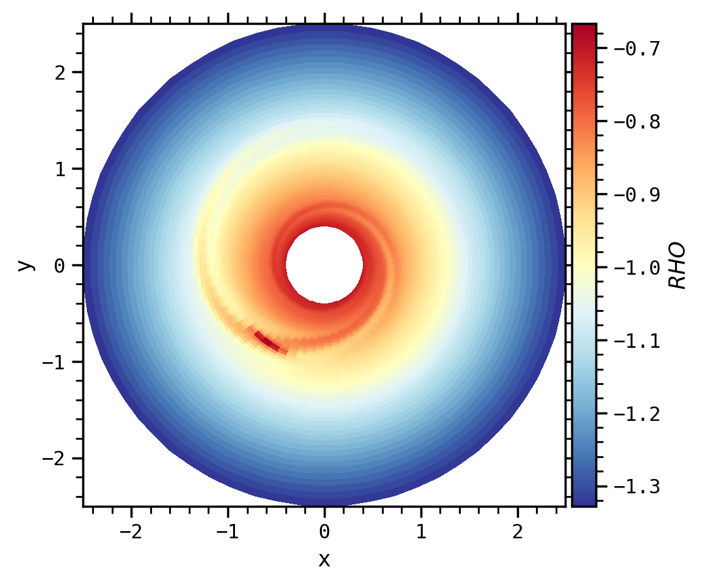
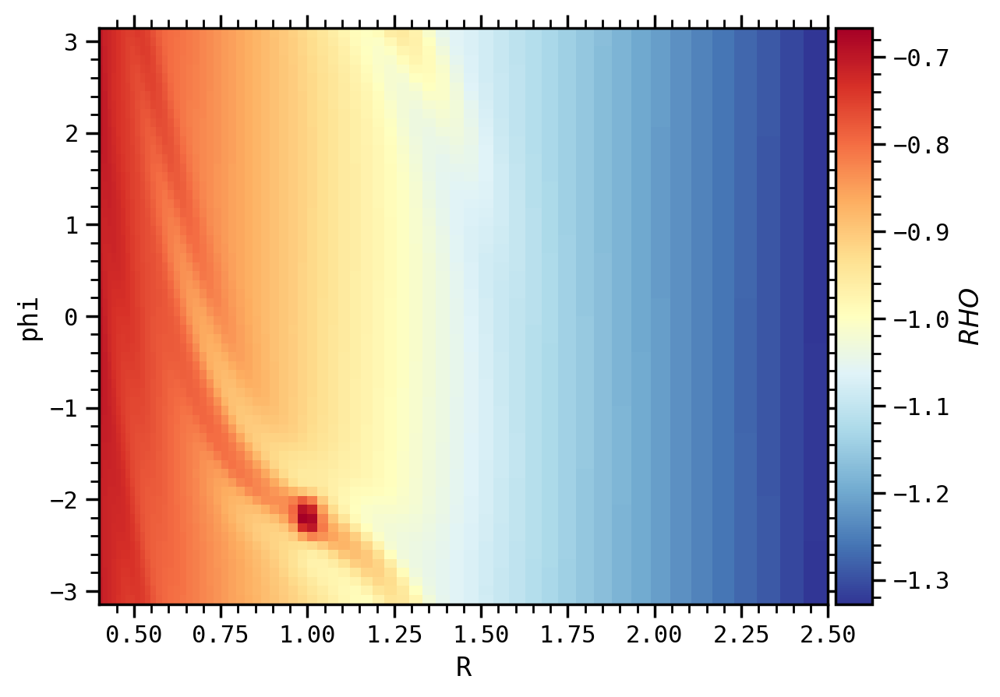
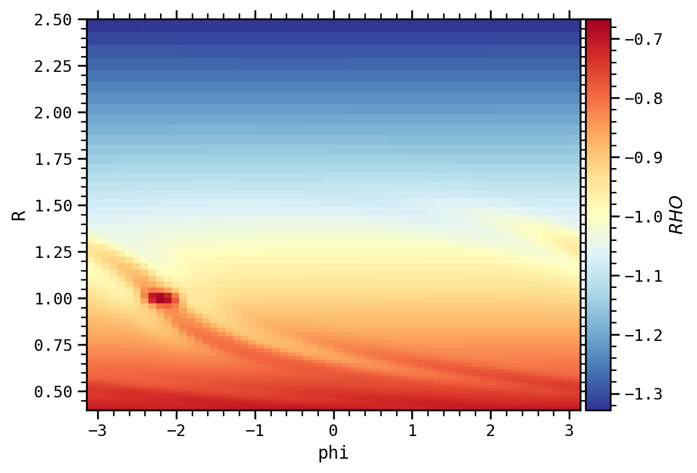
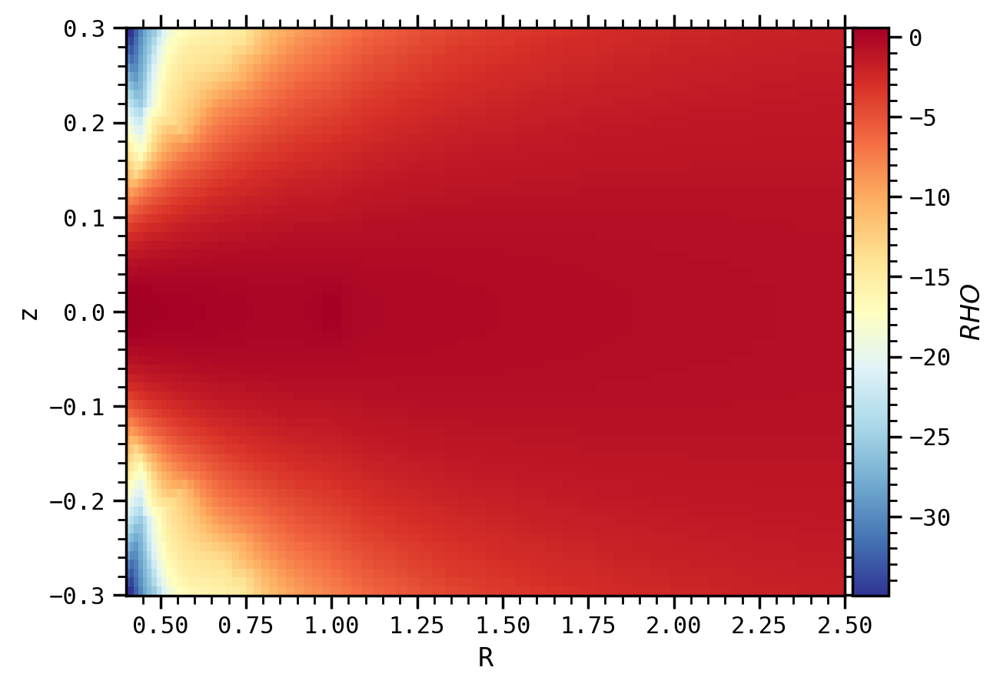
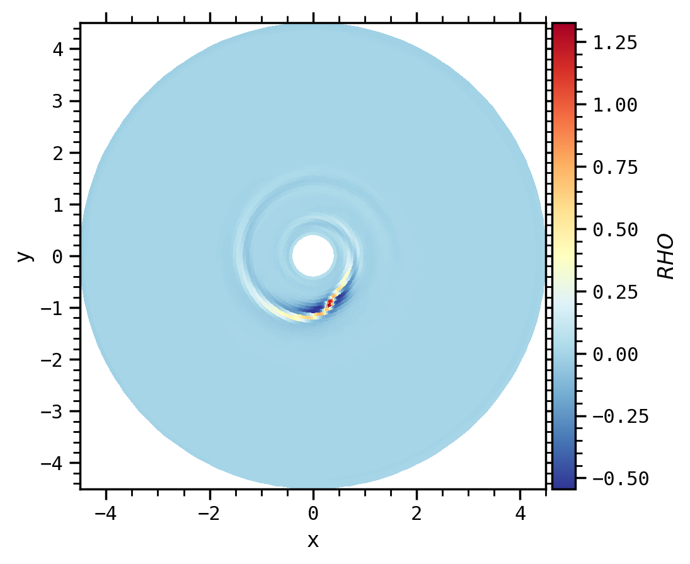
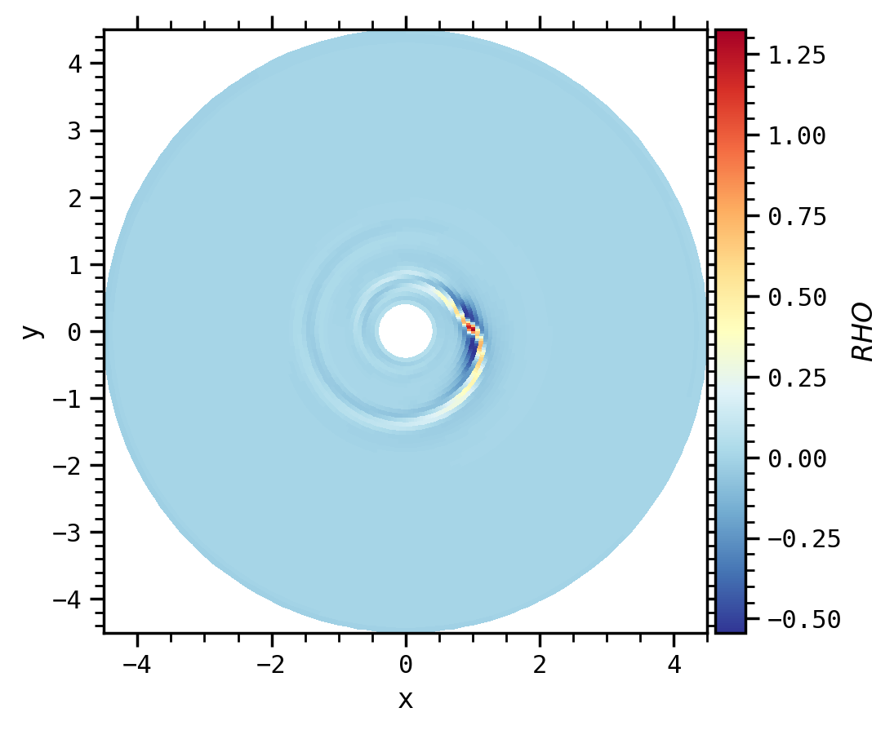
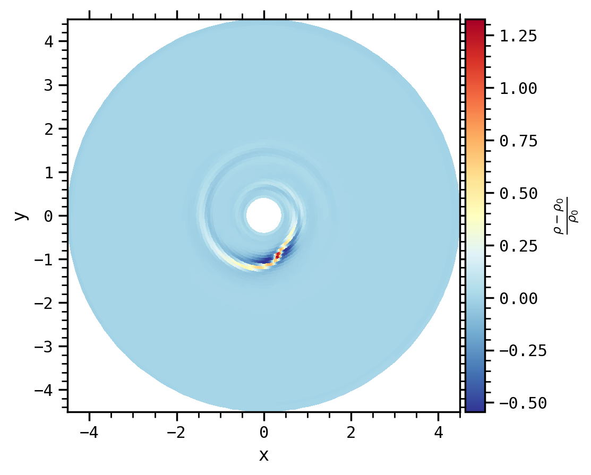
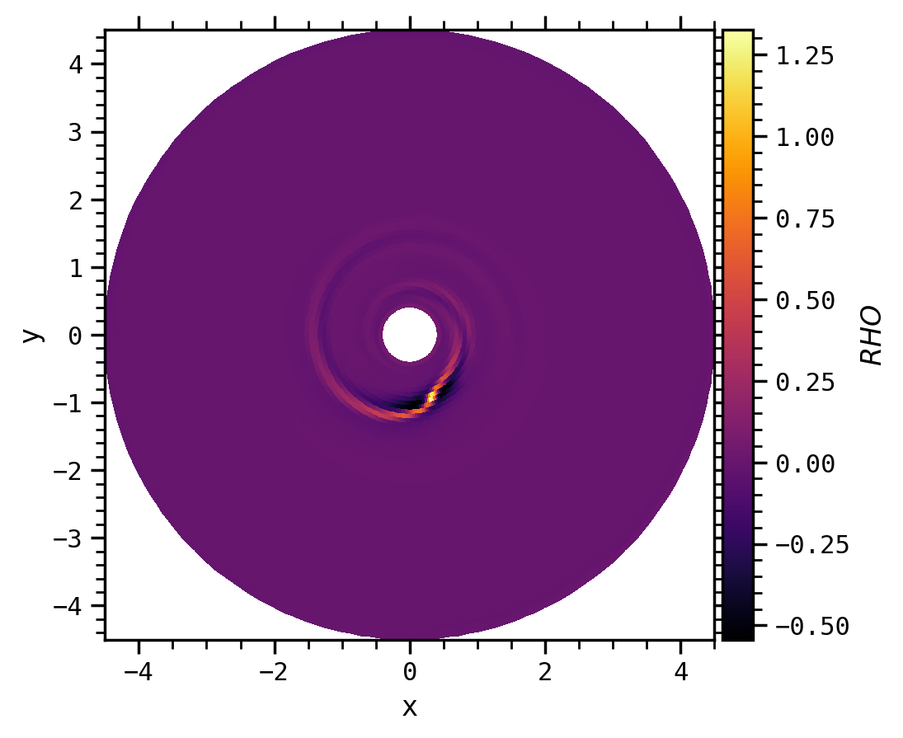
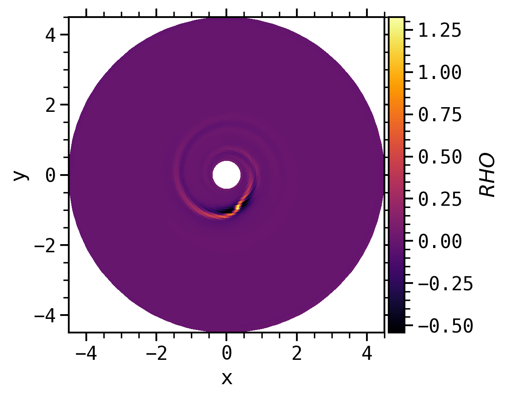

# Usage in command line (CLI)

The nonos CLI gets its parameters from three sources:

* command line parameters
* a configuration file
* default values

!!! info "Priority"

    Command line parameters take priority over the configuration file, which itself takes priority over default values.

To get help, run
```shell
$ nonos --help
```

This will give an idea of the current possibilities provided by nonos.

!!! info "API"

    To have more control on the operations and plots you want to make, use the API

## Command line parameters

In order to use the CLI, you need to do `nonos` followed by one or several arguments. We introduce some important arguments in the following subsections.

### Type of output

* `-d`: open a graphic window with the plot (only works with a single image)
* `-fmt FORMAT`: save the output image in the selected file format (can be png, pdf, ...)
* `-dpi DPI`: image file resolution (default: 200)

### Field and output number

* `-field FIELD`: What field do you want to visualize ? [ex: `RHO` (default), `VX1`, `BX3`, ...]
* `-on ON` or `-all`: Either for one specific file (can be interactive or saved in a file), a range of files (start, end, [step]), or for all files in the working directory (only saved in a file).

!!! example "Example (idefix, 2D, polar $R$-$\phi$)"

    `nonos -field VX1 -on 0 -d`: will open the file `data.0000.vtk` and display a slice in the midplane of the radial velocity.

### Log and diff

* `-log`: compute the common logarithm (log10) of the field $f$, i.e. $\log(f)$
* `-diff`: compute the relative perturbation of the field (compared to the initial condition `data.0000.vtk`) $f$, i.e. $\displaystyle\frac{(f-f_0)}{f_0}$

!!! example "Example (idefix, 2D, polar $R$-$\phi$)"

    `nonos -log -all`: will open all the VTK files in the directory and save the log of the density in the midplane in PNG format.

### Operation

The `-operation` (or `-op`) command allows you to choose what operation is applied to the data, and can be paired with `-z`, `-theta`, `-phi`, or `-distance` depending on the operation.

| API function                         | corresponding CLI argument    |
|--------------------------------------|-------------------------------|
| `latitudinal_projection(theta)`      | `-op lp [-theta THETA]`       |
| `vertical_projection(z)`             | `-op vp [-z Z]`               |
| `vertical_at_midplane()`             | `-op vm`                      |
| `latitudinal_at_theta(theta)`        | `-op lt [-theta THETA]`       |
| `vertical_at_z(z)`                   | `-op vz [-z Z]`               |
| `azimuthal_at_phi(phi)`              | `-op ap [-phi PHI]`           |
| `azimuthal_at_planet(planet_number)` | `-op apl -corotate COROTATE`  |
| `azimuthal_average()`                | `-op aa`                      |
| `radial_at_r(distance)`              | `-op rr [-distance DISTANCE]` |
| `radial_average_interval(vmin,vmax)` | -                             |
| `remove_planet_hill(planet_number)`  | -                             |


!!! example "Example (idefix, 3D, polar $R$-$\phi$-$z$)"

    `nonos -on 5 -field BX3 -diff -op aa -fmt pdf`: will open the file `data.0005.vtk`, and perform an azimuthal average of the relative perturbation of the vertical component of the magnetic field $B_z$ before saving it in a PDF file.

!!! info "Chain the operations"

    You can cumulate some operations, like `-op lp aa`.

### Plane

The `-plane` argument is based on the `map("XDIR","YDIR")` function. Depending on the native geometry of the data and the target geometry of the visualization, you may choose various values for the `-plane` argument.

!!! example "Examples (idefix, 3D, polar $R$-$\phi$-$z$)"

    * `nonos -d -on 0 -log -op vp -z 0.1`**`-plane x y`**
    <figure markdown>
      { width="400" }
      <figcaption>Vertical projection of the logarithm of the density</figcaption>
    </figure>

    * `nonos -d -on 0 -log -op vp -z 0.1`**`-plane R phi`**
    <figure markdown>
      { width="400" }
      <figcaption>Vertical projection of the logarithm of the density</figcaption>
    </figure>
    * `nonos -d -on 0 -log -op vp -z 0.1`**`-plane phi R`**
    <figure markdown>
      { width="400" }
      <figcaption>Vertical projection of the logarithm of the density</figcaption>
    </figure>
    * `nonos -d -on 0 -log -op apl -corotate 0`**`-plane R z`**
    <figure markdown>
      { width="400" }
      <figcaption>Logarithm of the density at the planet azimuth</figcaption>
    </figure>
    * `nonos -d -on 0 -log -op apl -corotate 0`**`-plane theta r`**
    <figure markdown>
      { width="400" }
      <figcaption>Logarithm of the density at the planet azimuth</figcaption>
    </figure>

!!! warning "Warning"

    Some target geometries may not be possible, or may not yet be implemented, or may give strange results. If so, try another one to check the result or use the API instead.

### Some other arguments

!!! example "Reference example (idefix, 2D, polar $R$-$\phi$)"

    `nonos -on 23 -diff -plane x y`
    <figure markdown>
      { width="400" }
      <figcaption>Density at the midplane</figcaption>
    </figure>

* `-corotate COROTATE`: planet number that defines with which planet the grid corotates.

!!! example "Comparison (idefix, 2D, polar $R$-$\phi$)"

    `nonos -on 23 -diff -plane x y -corotate 0`
    <figure markdown>
      { width="400" }
      <figcaption>Density at the midplane</figcaption>
    </figure>

* `-range x x x x`: range of matplotlib window

!!! example "Comparison (idefix, 2D, polar $R$-$\phi$)"

    `nonos -on 23 -diff -plane x y -range x x -2 0` will perform a zoom in the y-axis
    <figure markdown>
      { width="400" }
      <figcaption>Density at the midplane</figcaption>
    </figure>

* `-vmin VMIN` and `-vmax VMAX`: min and max values of the field

!!! example "Comparison (idefix, 2D, polar $R$-$\phi$)"

    `nonos -on 23 -diff -plane x y -vmin -0.5 -vmax 0.5`
    <figure markdown>
      { width="400" }
      <figcaption>Density at the midplane</figcaption>
    </figure>

* `-cpu NCPU` or `-ncpu NCPU`: compute and save multiple images in parallel. You can also use `-pbar` to display a progress bar

!!! example "Example (idefix)"

    `nonos -on 0 6 2 -cpu 2 -pbar` will produce 4 PNG files corresponding to `ON = 0, 2, 4, 6` with 2 processors, and displaying a progress bar.

* `-title TITLE`: name of the field in the colorbar

!!! example "Comparison (idefix, 2D, polar $R$-$\phi$)"

    `nonos -on 23 -diff -plane x y -title "\frac{\rho-\rho_0}{\rho_0}"`
    <figure markdown>
      { width="400" }
      <figcaption>Density at the midplane</figcaption>
    </figure>

* `-cmap CMAP`: choice of the colormap

!!! example "Comparison (idefix, 2D, polar $R$-$\phi$)"

    `nonos -on 23 -diff -plane x y -cmap inferno` will perform a zoom in the y-axis
    <figure markdown>
      { width="400" }
      <figcaption>Density at the midplane</figcaption>
    </figure>

* `-scaling`: scale the overall sizes of features in the graph (fonts, linewidth...)

!!! example "Comparison (idefix, 2D, polar $R$-$\phi$)"

    `nonos -on 23 -diff -plane x y -cmap inferno -scaling 1.2`
    <figure markdown>
      { width="400" }
      <figcaption>Density at the midplane</figcaption>
    </figure>

* `-dir DATADIR`: location of output files and param files

!!! warning "Old outputs"

    For old idefix outputs, or if the geometry of the outputs is not recognized, you will need to add the `-geometry` command to process the data.

## Configuration file

The CLI will read parameters from a local file named `nonos.ini` if it exists,
or any other name specified using the `-i/-input` parameter.
To ignore any existing `nonos.ini` file, use the `-isolated` flag.

One way to configure nonos is to use
```shell
$ nonos -config
```

which prints the current configuration to stdout.
You can then redirect it to get a working configuration file as
```shell
$ nonos -config > nonos.ini
```
This method can also be used to store a complete configuration file from command line arguments:
```shell
$ nonos -ncpu 8 -cmap viridis -operation vm -diff -vmin=-10 -vmax=+100 -config
```
As of nonos 0.7.0, this will print

```
# Generated with nonos 0.7.0
datadir            .
field              RHO
operation          vm
theta              unset
z                  unset
phi                unset
distance           unset
geometry           unset
on                 unset
diff               True
log                False
range              unset
vmin               -1e1
vmax               1e2
plane              unset
progressBar        False
corotate           unset
ncpu               8
scaling            1
cmap               viridis
title              unset
unit_conversion    1
format             unset
dpi                200
```
